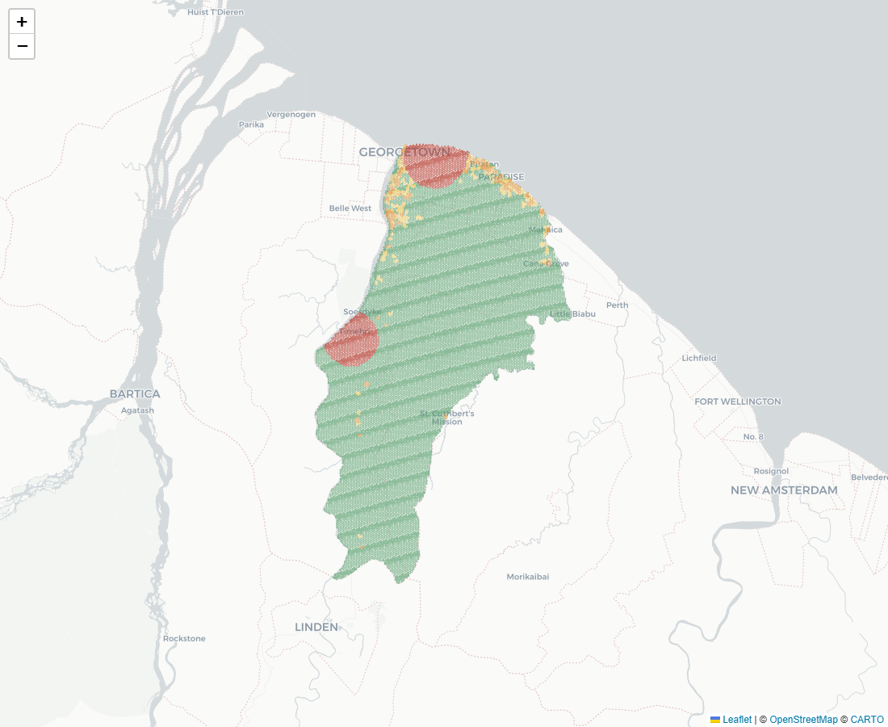
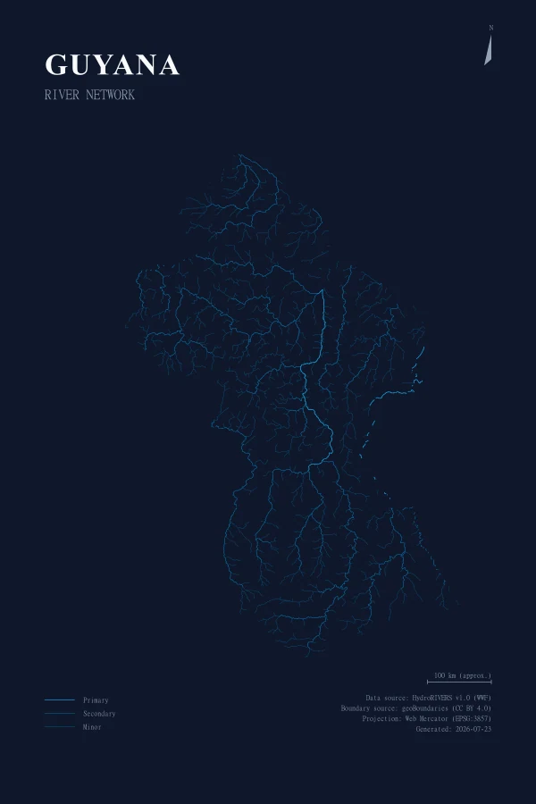
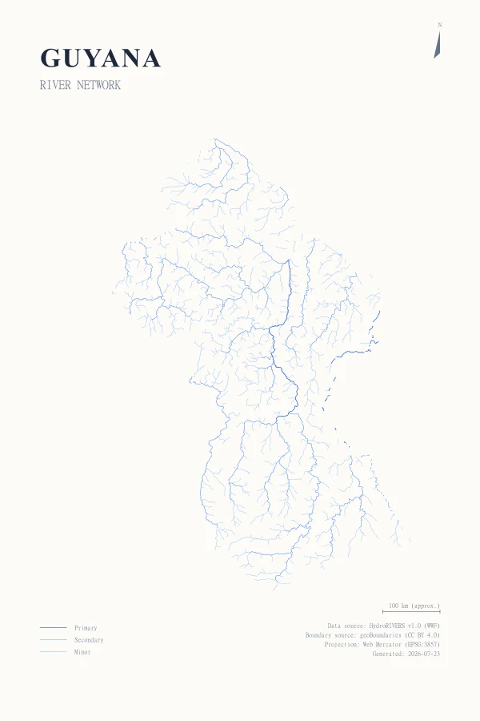
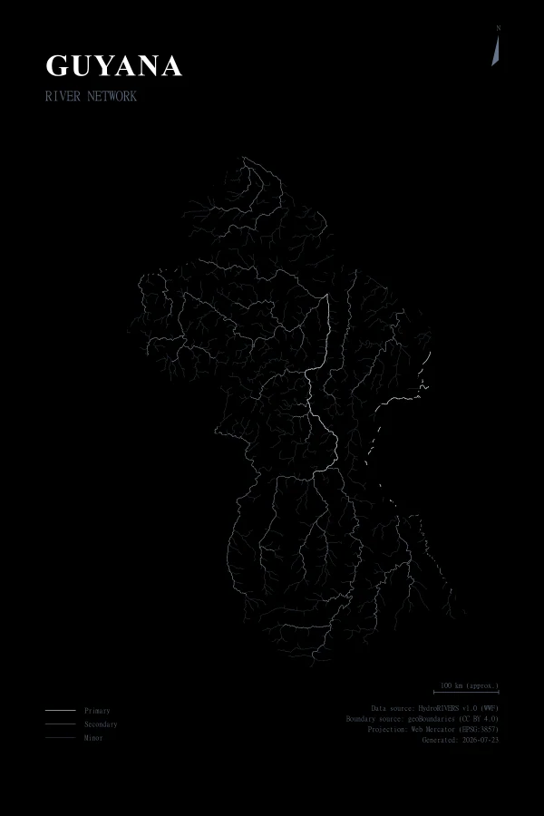
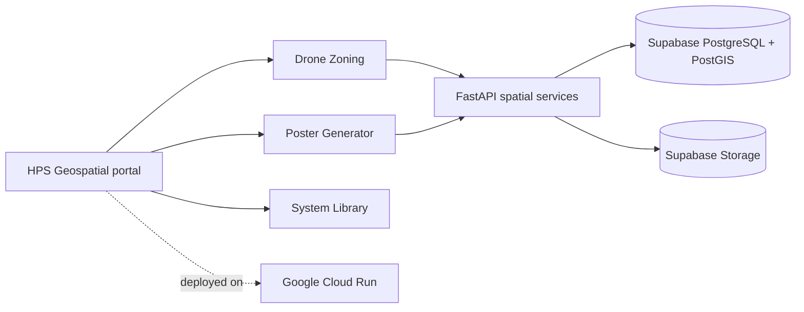

# HPS Geospatial

<div align="center">
  
</div>

<p align="center">
  <strong>Spatial systems and decision support.</strong><br />
  One shared geospatial platform, two working applications: Guyana Drone Zoning Decision Support and the Hydrographic Poster Generator.
</p>

<p align="center">
  <a href="https://hydro-frontend-54n4ik523a-uc.a.run.app/">Open the live platform</a>
  ·
  <a href="https://hydro-frontend-54n4ik523a-uc.a.run.app/drone">Drone Zoning overview</a>
  ·
  <a href="https://hydro-frontend-54n4ik523a-uc.a.run.app/drone/explore">Public Explorer</a>
  ·
  <a href="https://hydro-frontend-54n4ik523a-uc.a.run.app/poster">Poster Generator</a>
  ·
  <a href="https://hydro-frontend-54n4ik523a-uc.a.run.app/documentation">System Library</a>
</p>

## One platform, two applications

HPS Geospatial turns spatial data into usable planning guidance and communication products. The shared Next.js and FastAPI platform combines an explainable Drone Zoning workflow with a protocol-driven cartographic poster generator, backed by Supabase PostgreSQL/PostGIS and deployed on Google Cloud Run.

<table>
  <tr>
    <td width="50%" valign="top">
      <h3>Guyana Drone Zoning</h3>
      
      <p>A Region 4 decision-support pilot for evaluating operating suitability, explaining spatial classifications, and publishing a clear public planning view.</p>
      <p><a href="https://hydro-frontend-54n4ik523a-uc.a.run.app/drone/start"><strong>Choose a Drone Zoning view →</strong></a></p>
    </td>
    <td width="50%" valign="top">
      <h3>Hydrographic Poster Generator</h3>
      
      <p>A controlled workflow for clipping HydroRIVERS data, composing editorial cartography, and exporting print-ready posters or transparent design assets.</p>
      <p><a href="https://hydro-frontend-54n4ik523a-uc.a.run.app/poster"><strong>Open the Poster Generator →</strong></a></p>
    </td>
  </tr>
</table>

## Drone Zoning Decision Support

The Drone Zoning application separates public guidance from internal analytical and publication workflows.

### Public Explorer

- Loads the approved, published dissolved zoning layer rather than the analytical cell grid.
- Provides location-level explanations in clear language.
- Supports scale-dependent, availability-aware reference layers for airports, schools, healthcare, police, fire, and government facilities.
- Marks data-dependent runway and safeguarding layers as coming soon until suitable geometry is curated.
- Uses published materialized GeoJSON for fast retrieval while retaining PostgreSQL/PostGIS as the authoritative analytical record.

### Planning Console

- Configures planning factors, weights, buffers, and scenarios.
- Runs cell-level analysis and sensitivity comparisons.
- Explains scores, primary reasons, factor contributions, hard constraints, and data confidence.
- Separates draft, review, approval, publication, and public-serving responsibilities.
- Exports map views as PNG, SVG, or PDF and analytical geometry as GeoJSON.
- Keeps draft and fresh analyst runs on the dynamic API path while published runs use durable storage artifacts.

> [!IMPORTANT]
> Drone Zoning provides planning guidance, not flight authorization. It does not replace permission from the aviation authority or account for every live operational condition, temporary restriction, weather constraint, aircraft condition, or operator qualification.

## Hydrographic Poster Generator

The Poster Generator uses PostGIS-backed spatial clipping and a constrained composition system to transform supported HydroRIVERS geographies into designed outputs.

- **Spatial clipping:** Intersects registered river networks with supported administrative boundaries.
- **Cartographic protocols:** Applies controlled density, hierarchy, palette, typography, legend, metadata, and scale treatment.
- **Interactive composition:** Supports preview, framing, layout adjustment, and repeatable settings.
- **Poster outputs:** Produces high-resolution PNG, SVG, and PDF files.
- **Design Asset Mode:** Exports transparent river-network assets for downstream design workflows.

<p align="center">
  
  
  
</p>

## Shared architecture

| Layer | Responsibility |
| --- | --- |
| **Next.js and React** | HPS portal, public and internal Drone views, Poster Generator, and System Library |
| **Leaflet** | Interactive published and analytical Drone maps |
| **FastAPI** | Spatial APIs, model-run orchestration, publication, and poster rendering/export |
| **Supabase PostgreSQL/PostGIS** | Authoritative zoning, reference, boundary, and hydrographic records |
| **Supabase Storage** | Durable published-run manifests and materialized GeoJSON artifacts |
| **Supabase Auth** | Planning Console identity and role enforcement |
| **Google Cloud Run** | Containerized frontend and backend deployment |



## Application routes

| Destination | Live route |
| --- | --- |
| HPS Geospatial platform | [`/`](https://hydro-frontend-54n4ik523a-uc.a.run.app/) |
| Drone Zoning overview | [`/drone`](https://hydro-frontend-54n4ik523a-uc.a.run.app/drone) |
| Public/internal view chooser | [`/drone/start`](https://hydro-frontend-54n4ik523a-uc.a.run.app/drone/start) |
| Public Explorer | [`/drone/explore`](https://hydro-frontend-54n4ik523a-uc.a.run.app/drone/explore) |
| Hydrographic Poster Generator | [`/poster`](https://hydro-frontend-54n4ik523a-uc.a.run.app/poster) |
| System Library | [`/documentation`](https://hydro-frontend-54n4ik523a-uc.a.run.app/documentation) |

## Current status

- **Drone Zoning:** Active Region 4, Demerara-Mahaica pilot with public, analyst, and administrative surfaces.
- **Reference data:** Airports, schools, healthcare, police, fire, and government facilities are availability-aware; runway and safeguarding geometry remains data-dependent.
- **Poster Generator:** Operational preview, composition, QA, and PNG/SVG/PDF export workflow.
- **Deployment:** Separate frontend and backend containers running on Google Cloud Run.

## Running locally

The full stack runs through Docker Compose against a reachable PostGIS database.

```bash
cp .env.example .env

# Set DATABASE_URL in .env, then start both services.
docker compose up --build
```

- Frontend: [http://localhost:3000](http://localhost:3000)
- Backend API documentation: [http://localhost:8000/docs](http://localhost:8000/docs)

For Drone authentication and published-artifact workflows, also configure the Supabase URL, browser-safe publishable key, service-role key, and published-artifacts bucket documented in [`.env.example`](.env.example). See the [Deployment Guide](docs/DEPLOYMENT.md) for manual installation, environment, security, Cloud Build, and Cloud Run details.

## Data and ingestion

Large source geospatial datasets are intentionally stored outside Git. PostgreSQL/PostGIS holds the runtime analytical data; source Shapefiles, File Geodatabases, and full HydroRIVERS packages are not committed to this repository.

- [Data Ingestion Guide](docs/DATA_INGESTION.md)
- [Drone Reference Data](docs/DRONE_REFERENCE_DATA.md)
- [Poster Functional Specification](docs/MVP_FUNCTIONAL_SPEC.md)
- [Projection and Scale-Bar Notes](docs/PROJECTION_SCALEBAR_NOTES.md)

## Documentation

- [Live System Library](https://hydro-frontend-54n4ik523a-uc.a.run.app/documentation)
- [Deployment and rollback](docs/DEPLOYMENT.md)
- [UI/UX implementation record](docs/UI_UX_IMPLEMENTATION_PLAN.md)
- [Cloud Run audit](docs/CLOUD_RUN_AUDIT.md)
- [Repository roadmap](docs/ROADMAP.md)

The repository retains its historical `hydrographic-poster-generator` name, while HPS Geospatial is the current parent platform identity.
