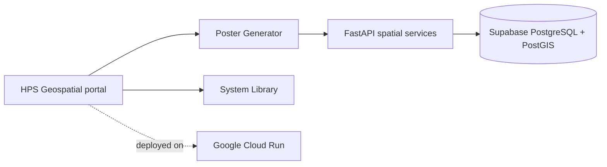

# HPS Geospatial

<div align="center">
  
</div>

<p align="center">
  <strong>Connecting form and function.</strong><br />
  A spatial data toolbox for producing clear, repeatable hydrographic cartography.
</p>

<p align="center">
  <a href="https://hydro-frontend-54n4ik523a-uc.a.run.app/">Open the live platform</a>
  ·
  <a href="https://hydro-frontend-54n4ik523a-uc.a.run.app/poster">Poster Generator</a>
  ·
  <a href="https://hydro-frontend-54n4ik523a-uc.a.run.app/documentation">System Library</a>
</p>

## Hydrographic Poster Generator

The HPS Hydrographic Poster Generator uses PostGIS-backed spatial clipping and a constrained composition system to transform supported HydroRIVERS geographies into designed outputs.

- **Spatial clipping:** Intersects registered river networks with supported administrative boundaries.
- **Cartographic protocols:** Applies controlled density, hierarchy, palette, typography, legend, metadata, and scale treatment.
- **Interactive composition:** Supports preview, framing, layout adjustment, country-aware palettes, and repeatable settings.
- **Poster outputs:** Produces high-resolution PNG, SVG, and PDF files.
- **Design Asset Mode:** Exports transparent river-network assets for downstream design workflows.

<p align="center">
  
  
  
</p>

## Architecture

| Layer | Responsibility |
| --- | --- |
| **Next.js and React** | HPS portal, Poster Generator, and System Library |
| **FastAPI** | Spatial clipping, preview, rendering, and export APIs |
| **Supabase PostgreSQL/PostGIS** | Authoritative boundary, hydrographic, preset, and application records |
| **Google Cloud Run** | Containerized frontend and backend deployment |



## Live routes

| Destination | Route |
| --- | --- |
| HPS Geospatial platform | [`/`](https://hydro-frontend-54n4ik523a-uc.a.run.app/) |
| Hydrographic Poster Generator | [`/poster`](https://hydro-frontend-54n4ik523a-uc.a.run.app/poster) |
| Poster Studio | [`/studio`](https://hydro-frontend-54n4ik523a-uc.a.run.app/studio) |
| System Library | [`/documentation`](https://hydro-frontend-54n4ik523a-uc.a.run.app/documentation) |
| Product documentation | [`/docs`](https://hydro-frontend-54n4ik523a-uc.a.run.app/docs) |

## Running locally

The stack runs through Docker Compose against a reachable PostGIS database.

```bash
cp .env.example .env

# Set DATABASE_URL in .env, then start both services.
docker compose up --build
```

- Frontend: [http://localhost:3000](http://localhost:3000)
- Backend API documentation: [http://localhost:8000/docs](http://localhost:8000/docs)

See the [Deployment Guide](docs/DEPLOYMENT.md) for environment, security, Cloud Build, and Cloud Run details.

## Data and documentation

Large source geospatial datasets are intentionally stored outside Git. PostgreSQL/PostGIS holds runtime data; source Shapefiles, File Geodatabases, and full HydroRIVERS packages are not committed to this repository.

- [Data Ingestion Guide](docs/DATA_INGESTION.md)
- [Poster Functional Specification](docs/MVP_FUNCTIONAL_SPEC.md)
- [Projection and Scale-Bar Notes](docs/PROJECTION_SCALEBAR_NOTES.md)
- [Deployment and rollback](docs/DEPLOYMENT.md)
- [UI/UX implementation record](docs/UI_UX_IMPLEMENTATION_PLAN.md)
- [Cloud Run audit](docs/CLOUD_RUN_AUDIT.md)

The repository retains its historical `hydrographic-poster-generator` name, while HPS Geospatial is the current parent platform identity.
